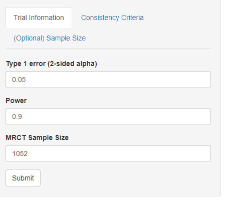
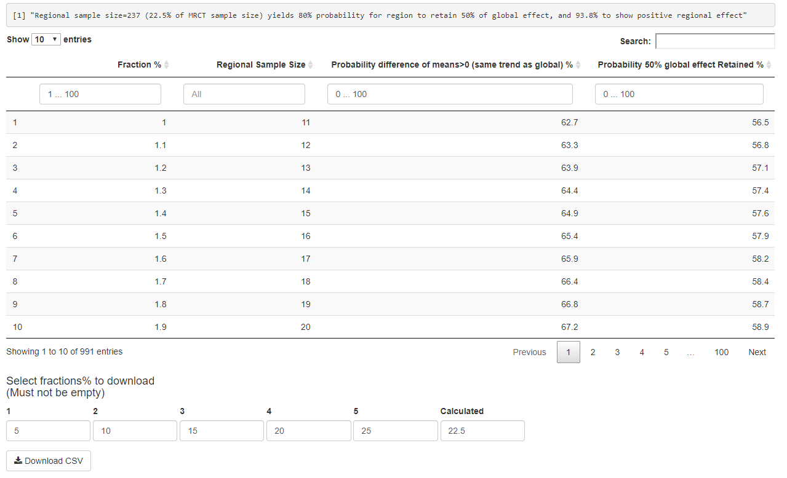
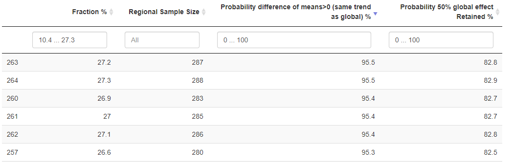

# Introduction to the regional sample size planning tool
Licensed under the MPL-2.0 license.

### Multivation
As a statistician, in MRCTs we often face the 

### Table of contents
- [Layout of the app](#layout)
- [Tutorial](#tutorial1)
  - [Step 1: Identify the endpoint of interest](#identify) 
  - [Step 2: Fill in required information](#fill-in1) 
  - [Step 3: Submit!](#submit)
  - [Step 4: View the output section](#output1) 
  - [Step 5: Download csv file](#download-csv) 
- [Tutorial (Time to event)](#tutorial2) 
  - [Fill in required information](#fill-in2) 
  - [Output table](#output2) 
- [Reference](#reference) 

<h3 id="layout">Layout of the app</h3> 
**Entering the tool**: The homepage has a link to this page

**The "Normal endpoints" tab**: Consists with a side pannel on the left and results section on the right.

**The "Time-to-event endpoints" tab**: Consists with a slightly different side pannel on the left and results section on the right.

 

<h3 id="tutorial1">Tutorial</h3> 

<h4 id="identify">Step 1: Identify the endpoint of interest</h4> 
If you are planning the sample size focusing on the 

The below steps will use difference of means (normal) as endpoint for illustration.  

<h4 id="fill-in1">Step 2: Fill in required information</h4> 

**"Type 1 error", "Power" and "MRCT sample size"** are needed for calculating the corresponding probabilities

**The optional tab**: Other parameters (in addition to type-1 error and power) allow you to calculate the sample size if it's not ready by hand

<h4 id="submit">Step 3: Submit! </h4>

After clicking the "Submit" button, it takes about 1-10 seconds for the table to appear.

<h4 id="output1">Step 4: View the output section</h4>

The sentence on top states the corresponding regional sample size when there's 80% chance 50% of the MRCT effect is retained.

The output table allows you to search specific ranges of interest for each column.

You can also sort colunmns ascendingly/descendingly, change the number of entries you want to display on one page etc.

<h4 id="download-csv">Step 5: Download the csv</h4>

The download section allows you to enter 6 regional sample size fractions (out of MRCT sample size) to download, the default fractions are 5%, 10%, 15%, 20%, 25% and the calculated fraction where 80% probability 50% of MRCT effect is retained.

The csv file will be downloaded directly to the default folder (normally download folder)

The table layout will be the same as the one in output section, with fractions of interest

 

<h3 id="tutorial2">Tutorial (Time to event)</h3> 

<h4 id="fill-in2">Fill in required information</h4>

<h4 id="output2">Output section</h4>

The remaining steps are the same.

<h3 id="reference">References</h3> 

- Quan, H., Zhao, P. L., Zhang, J., Roessner, M., & Aizawa, K. (2010). Sample size considerations for Japanese patients in a multi‐regional trial based on MHLW guidance. Pharmaceutical Statistics, 9(2), 100-112.
- Hayashi, Nobuya & Itoh, Yohji. (2018). A Re-examination of Japanese Sample Size Calculation for Multi-regional Clinical Trial Evaluating Survival Endpoint. Japanese Journal of Biometrics. 38. 10.5691/jjb.38.79. 
- Packages used for building the app: 
  - httpuv
  - shiny
  - shinydashboard
  - shinyjs
  - DT
  - shinycssloaders

### End
Features including plotting and other common endpoints will be added in the future

