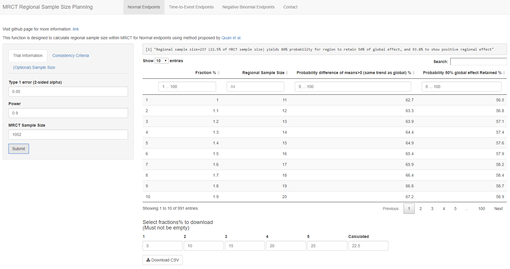
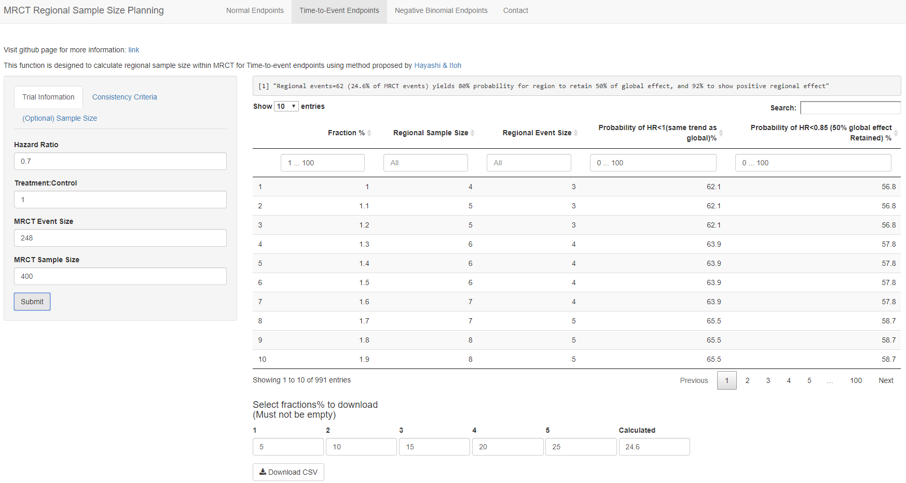
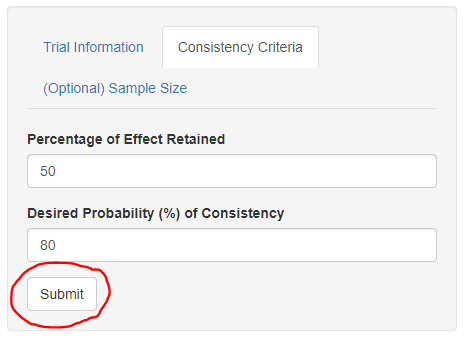
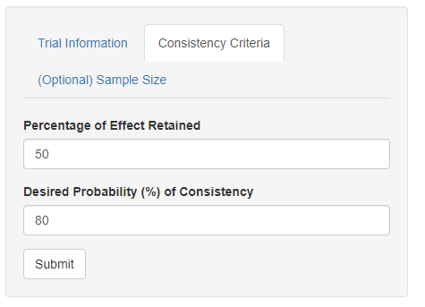
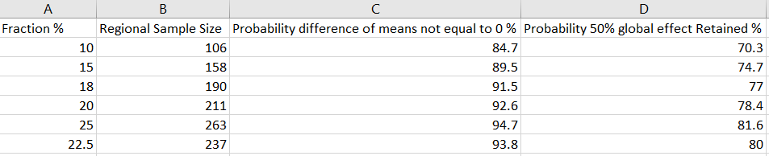
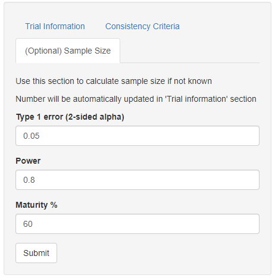
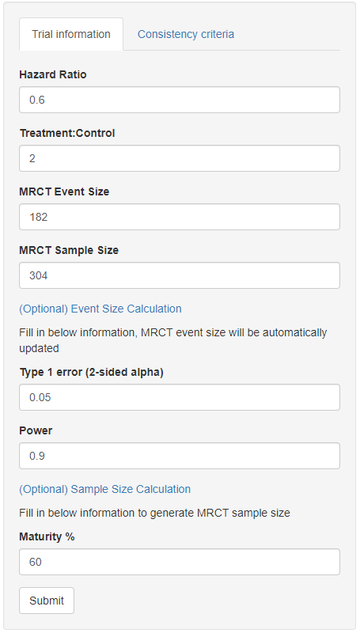
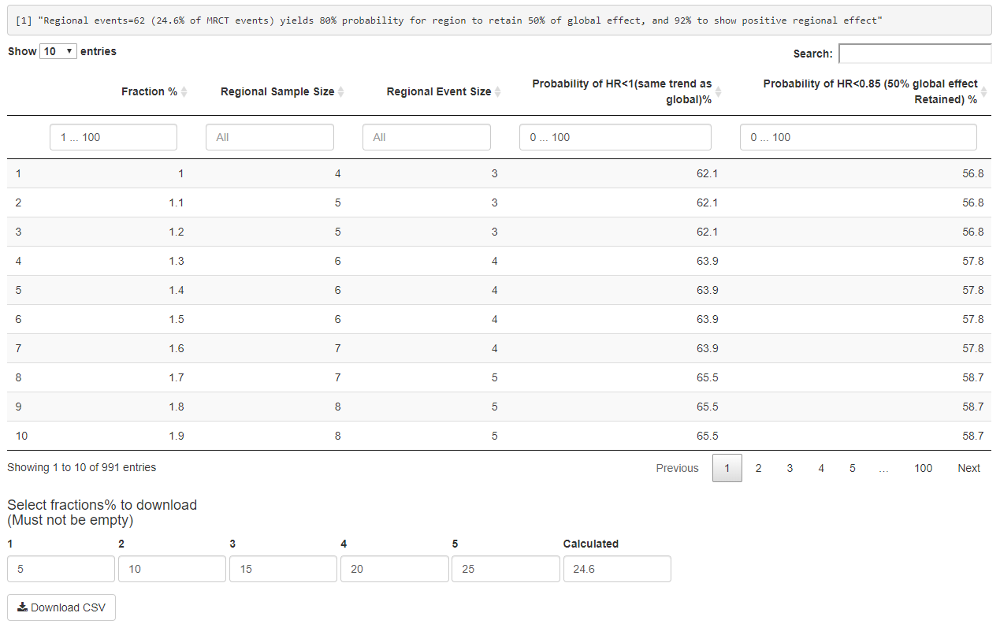

# Introduction to the regional sample size planning tool
Licensed under the MPL-2.0 license.

### Multivation
In MRCTs we often face the need to plan sample size for individual regions/countries.

With certain number of patients for a region, if there's reasonable probability (e.g.80%) that the desired proportion (e.g.50%) of overall treatment effect can be retained, and the treatment effect is positive, we can demonstrate that the sample size for that region is plausible from a statistical perspective. With desired criteria, we can in turn decide how many sample size we want to allocate to that region.

Note that the desired consistency probability and proportion to retain effect varie across regions/countries, studies, endpoints etc. The final decision should be based on not only statistical characteristics, but also regulatory requirements, operational feasibility etc. Please refer to ICH E5& E17 for other important factors to consider.

Note that changing the sample size of a region will not impact MRCT sample size, only the fraction of sample size allocating to that region changes.

 

### Table of contents
- [Layout of the app](#layout)
- [Tutorial](#tutorial1)
  - [Step 1: Identify the endpoint of interest](#identify) 
  - [Step 2: Fill in required information](#fill-in1) 
  - [Step 3: Submit!](#submit)
  - [Step 4: View the output section](#output1) 
  - [Step 5: Download csv file](#download-csv) 
- [Tutorial (Time to event)](#tutorial2) 
  - [Fill in required information](#fill-in2) 
  - [Optional: Event and sample size calculation](#optional) 
  - [Output table](#output2) 
- [Reference](#reference) 

 

<h3 id="layout">Layout of the app</h3> 

- **Entering the tool**: The homepage has a link to this github page

- **The "Normal endpoints" tab**: Consists with a side pannel on the left and results section on the right.

- **The "Time-to-event endpoints" tab**: Consists with a slightly different side pannel on the left and results section on the right.

 

<h3 id="tutorial1">Tutorial</h3> 

<h4 id="identify">Step 1: Identify the endpoint of interest</h4> 

If you are planning the sample size based on difference of means endpoint, select the "Normal endpoints" tab.

For time-to-event endpoints such as survival, PFS, EFS etc. the "Time-to-event points" tab should be selected.

The below steps will use difference of means (normal) as endpoint for illustration.  

<h4 id="fill-in1">Step 2: Fill in required information</h4> 

- "Type 1 error", "Power" and "MRCT sample size" are needed for calculating the corresponding probabilities

- Optional (sample size calculation): Input other parameters (in addition to type 1 error and power) allow you to calculate the sample size if it's not ready by hand

- Check consistency critieria: Specify desired consistency probability with the proportion of global effect to be retained

<h4 id="submit">Step 3: Submit! </h4>

- After clicking the "Submit" button, it takes about 1-10 seconds for the table to appear.

<h4 id="output1">Step 4: View the output section</h4>

- The sentence on top states the corresponding regional sample size when there's 80% chance 50% of the MRCT effect is retained.

- The output table allows you to search specific ranges of interest for each column.

- You can also sort colunmns ascendingly/descendingly, change the number of entries you want to display on one page etc.

<h4 id="download-csv">Step 5: Download the csv</h4>

- The download section allows you to enter 6 regional sample size fractions (out of MRCT sample size) to download, the default fractions are 5%, 10%, 15%, 20%, 25% and the calculated fraction where 80% probability 50% of MRCT effect is retained.

- The csv file will be downloaded directly to the default folder (normally download folder)

- The table layout will be the same as the one in output section, with fractions of interest

 

<h3 id="tutorial2">Tutorial (Time to event)</h3> 

<h4 id="fill-in2">Fill in required information</h4>

- Fill in 'Hazard ratio', 'Treatment:Control' (ratio), 'MRCT event size' and 'MRCT sample size' (optional: if empty, the output will not have regional sample size information)

<h4 id="optional">Optional: Event and sample size calculation</h4>

- If event size is not ready by hand, fill in type 1 error and power in addition to calculate

- Sample size can be calculated further by specifying the maturity of events at analysis

- Check the consistency criteria

<h4 id="output2">Output section</h4>

- The output section is slightly different, including an additional column 'Regional event size' 

The remaining steps are the same.

Note that for time-to-event endpoint, the fraction applies to both sample 

<h3 id="reference">References</h3> 

- Quan, H., Zhao, P. L., Zhang, J., Roessner, M., & Aizawa, K. (2010). Sample size considerations for Japanese patients in a multi‐regional trial based on MHLW guidance. Pharmaceutical Statistics, 9(2), 100-112.
- Hayashi, Nobuya & Itoh, Yohji. (2018). A Re-examination of Japanese Sample Size Calculation for Multi-regional Clinical Trial Evaluating Survival Endpoint. Japanese Journal of Biometrics. 38. 10.5691/jjb.38.79. 
- Packages used for building the app: 
  - httpuv
  - shiny
  - shinydashboard
  - shinyjs
  - DT
  - shinycssloaders

### End
Features including plotting and other common endpoints will be added in the future

 
